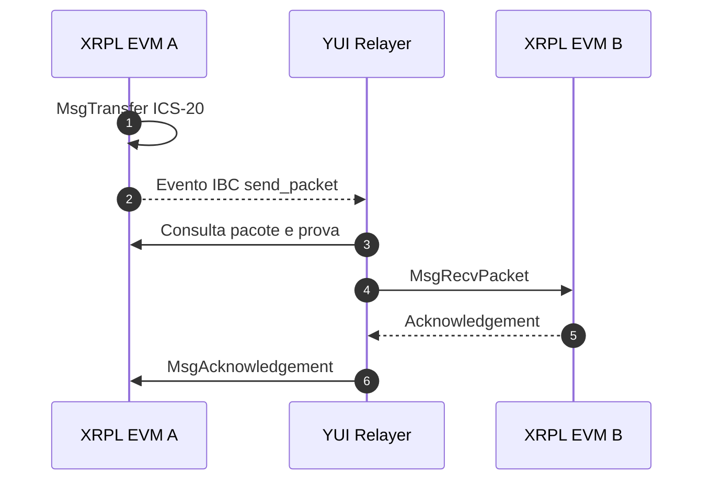

<div align="center" id="topo">

# <code><strong>YUI Relayer para XRPL EVM, Cosmos SDK e Besu</strong></code>

Fork do YUI Relayer preparado para interoperabilidade IBC entre chains XRPL EVM, Cosmos SDK e Besu.

> Este repositório é um fork de
> [hyperledger-labs/yui-relayer](https://github.com/hyperledger-labs/yui-relayer).
> O código original, sua documentação e seu histórico permanecem disponíveis no projeto upstream.

[](https://go.dev/)
[](https://docs.docker.com/engine/)
[](https://docs.docker.com/compose/)
[](https://www.python.org/)
[](https://ibcprotocol.dev/)
[](https://github.com/hyperledger-labs/yui-relayer)

</div>

---

# 📑 Índice

- [📌 Sobre](#sobre)
- [🏗️ Arquitetura](#arquitetura)
- [📁 Estrutura do fork](#estrutura)
- [⚙️ Configuração declarativa](#configuracao)
- [🚀 Ciclo completo com XRPL EVM](#execucao)
- [🧭 Comandos do orquestrador](#comandos)
- [🌐 Adicionar outro módulo ou profile](#novo-modulo)
- [🧹 Limpeza](#limpeza)
- [🔗 Código-fonte](#codigo-fonte)
- [🔧 Alterações para XRPL EVM, Cosmos SDK e Besu](#compatibilidade)

---

<a id="sobre"></a>
# 📌 Sobre

O fork mantém o binário `yrly` do YUI e acrescenta uma camada modular de
orquestração em Python e Docker. Essa camada recebe descritores dos módulos de
blockchain, gera a configuração nativa do relayer e persiste seu estado em
`runtime/`.

No exemplo de configuração XRPL deste documento, o fluxo conecta duas XRPL EVM
Sidechains locais:

| Nome | Chain ID | Prefixo Bech32 | Ativo nativo |
|---|---|---|---|
| `xrplevm-a` | `xrplevm_1450001-1` | `ethm` | `axrp` |
| `xrplevm-b` | `xrplevm_1450002-1` | `ethm` | `axrp` |
| `xrplevm-c` | `xrplevm_1450003-1` | `ethm` | `axrp` |

O YUI registra as chains, importa as chaves dos relayers, inicializa seus light
clients locais e executa o handshake IBC. O financiamento das contas e a
inicialização das blockchains continuam sendo responsabilidades dos respectivos
módulos, não do relayer.

[⬆ Voltar ao topo](#topo)

---

<a id="arquitetura"></a>
# 🏗️ Arquitetura



O comando de transferência submete a transação à chain de origem. O serviço do
YUI observa o evento, transporta o pacote para a chain de destino e devolve o
acknowledgement.

As chains e o relayer devem estar conectados à mesma rede Docker externa. No
ambiente XRPL, essa rede é `interoperability_network`.

[⬆ Voltar ao topo](#topo)

---

<a id="estrutura"></a>
# 📁 Estrutura do fork

```text
yui-relayer/
├── Dockerfile                 # build local do binário yrly
├── docker-compose.yaml        # serviço isolado do relayer
├── .env                       # IP, rede, container e imagem do YUI
├── main.py                    # entrada do orquestrador
├── modules/                   # validação, renderização e ciclo de vida
├── requirements.txt           # dependências Python do orquestrador
├── runtime/                   # configurações e estado gerados em execução
├── chains/                    # adapters de blockchain do YUI
└── core/                      # núcleo de relay e handshake IBC
```

O conteúdo de `runtime/` é local, persistente e ignorado pelo Git. O diretório é
montado no container como `/root/.yui-relayer` e contém, entre outros arquivos:

```text
runtime/
├── manifest.json
├── config/config.json
├── chains/*.json
├── paths/*.json
├── keys/
└── light/
```

[⬆ Voltar ao topo](#topo)

---

<a id="configuracao"></a>
# ⚙️ Configuração declarativa

O relayer recebe três tipos de arquivo de cada módulo de blockchain:

| Arquivo | Responsabilidade |
|---|---|
| `profile.json` | adapter, prefixo Bech32, gas, tempo médio de bloco e trusting period |
| `chains.json` | nome, chain ID, serviço Docker e endereço RPC de cada chain |
| `relayer-accounts.json` | nome, associação com a chain e mnemonic do relayer |

No exemplo com o módulo XRPL, esses arquivos ficam em `xrpl-cosmos/config/`.
O primeiro `init` exige os três caminhos. A execução cria
`yui-relayer/runtime/manifest.json`, que registra as fontes utilizadas e permite
omitir os caminhos nos comandos seguintes.


[⬆ Voltar ao topo](#topo)

---

<a id="execucao"></a>
# 🚀 Ciclo completo com XRPL EVM

O módulo XRPL é apenas uma fonte de configuração para este exemplo. Antes de
inicializar o YUI, considere que:

- `xrpl-cosmos/config/` contém `profile.json`, `chains.json` e
  `relayer-accounts.json`;
- as chains XRPL já estão inicializadas, sincronizadas e acessíveis pelos nomes
  declarados em `chains.json`;
- as chains e o YUI utilizam a rede Docker externa
  `interoperability_network`;
- as contas dos relayers já possuem saldo para pagar as transações do
  handshake e do relay.

O YUI não inicializa as chains XRPL nem financia suas contas. 

## 1. Inicializar o YUI

No primeiro `init`, informe os descritores do módulo XRPL:

```bash
python yui-relayer/main.py init \
  --profile xrpl-cosmos/config/profile.json \
  --chains xrpl-cosmos/config/chains.json \
  --relayer-accounts xrpl-cosmos/config/relayer-accounts.json
```

<details>
<summary>Comandos Encapsulados</summary>

Depois que o Compose e os arquivos nativos das chains forem gerados e o
container estiver ativo, a parte equivalente no binário YUI é:

```bash
yrly config init
yrly config show
yrly chains add-dir /root/.yui-relayer/chains

yrly tendermint keys show <chain-id> <key-name> || \
  yrly tendermint keys restore <chain-id> <key-name> "<mnemonic>"

yrly tendermint light header <chain-id> 0 || \
  yrly tendermint light init <chain-id> -f
```

Os comandos de chave e light client são repetidos para cada chain Tendermint.
Chains Ethereum/Besu recebem o signer no descritor e não executam essas duas
etapas. 

</details>

O comando:

1. valida os descritores e o `.env`;
2. gera `yui-relayer/docker-compose.yaml` e os arquivos nativos das chains;
3. cria ou atualiza `yui-relayer/runtime/manifest.json`;
4. valida Docker e a rede externa;
5. constrói e inicia o container `yui-relayer`;
6. inicializa a configuração global do YUI;
7. registra as chains;
8. importa as chaves dos relayers;
9. inicializa os light clients locais.

O `init` não cria paths e não inicia o serviço contínuo de relay. Em execuções
seguintes, o manifest permite usar apenas:

```bash
python yui-relayer/main.py init --no-build
```

<details>
<summary>Comandos Encapsulados</summary>

O conjunto de chamadas `yrly` é o mesmo do primeiro `init`. Em um runtime já
configurado, o fluxo consulta antes de alterar:

```bash
yrly config show
yrly tendermint keys show <chain-id> <key-name>
yrly tendermint light header <chain-id> 0
```

Se uma chain, chave ou light client estiver ausente, executa respectivamente
`chains add-dir`, `keys restore` ou `light init`. `--no-build` afeta somente o
Docker e não altera os comandos do binário.

</details>

## 2. Criar o path IBC

```bash
python yui-relayer/main.py path xrplevm-a xrplevm-b
```

<details>
<summary>Comandos Encapsulados</summary>

Considerando o arquivo do path já gerado em `runtime/paths/`:

```bash
yrly config show
yrly paths add \
  xrplevm_1450001-1 \
  xrplevm_1450002-1 \
  xrplevm-a-b \
  --file=/root/.yui-relayer/paths/xrplevm-a-b.json
yrly tx clients xrplevm-a-b
yrly tx connection xrplevm-a-b
yrly tx channel xrplevm-a-b
yrly config show
```

O orquestrador consulta o estado entre as etapas e omite os comandos cujos
client IDs, connection IDs ou channel IDs já estejam completos.

</details>

O nome padrão será `xrplevm-a-b`. O comando registra o path e cria ou reutiliza:

1. os IBC clients;
2. a connection;
3. o channel ICS-20.


## 3. Iniciar o serviço do relayer

Em um terminal dedicado:

```bash
python yui-relayer/main.py start xrplevm-a-b
```

<details>
<summary>Comandos Encapsulados</summary>

```bash
yrly service start xrplevm-a-b
```

</details>

Esse processo permanece em primeiro plano e exibe os logs do relay. Mantenha o
terminal aberto durante as transferências e interrompa o serviço com `Ctrl+C`.

## 4. Enviar uma transferência XRPL A → XRPL B

Em outro terminal:

```bash
python xrpl-cosmos/tests/transfer_to_xrpl.py xrplevm-a alice xrplevm-b alice
```

O exemplo envia `1 XRP` da conta `alice` da
chain `xrplevm-a` para a conta `alice` da chain `xrplevm-b`. 

## 5. Consultar o saldo na chain B

Use o Compose do módulo XRPL explicitamente:

```bash
python xrpl-cosmos/tests/check_balance.py xrplevm-b alice
```

O ativo recebido aparece como voucher `ibc/<hash>`.

[⬆ Voltar ao topo](#topo)

---

<a id="comandos"></a>
# 🧭 Comandos do orquestrador

Executar `python yui-relayer/main.py` sem argumentos tem o mesmo efeito
informativo de `python yui-relayer/main.py --help`.


| Comando | Comportamento |
|---|---|
| `validate` | valida descritores e ambiente sem alterar o runtime |
| `render` | gera o Compose e as configurações nativas das chains |
| `init` | sobe o relayer, registra chains e importa suas chaves |
| `path SOURCE DESTINATION` | cria ou valida path, clients, connection e channel |
| `start PATH` | inicia em primeiro plano o serviço contínuo de relay |
| `status` | exibe o container e a configuração nativa do YUI |

Opções compartilhadas pelos comandos de configuração:

| Opção | Uso |
|---|---|
| `--profile FILE` | adiciona um descritor de profile; pode ser repetida |
| `--chains FILE` | adiciona um descritor de chains; pode ser repetida |
| `--relayer-accounts FILE` | adiciona contas de relayer; pode ser repetida |
| `--chain CHAIN` | limita a operação à chain indicada; pode ser repetida |
| `--env-file FILE` | usa outro arquivo de ambiente |
| `--runtime-dir DIR` | usa outro diretório de runtime |
| `--no-build` | evita reconstruir a imagem durante o `init` |

Para consultar as opções específicas de um comando:

```bash
python yui-relayer/main.py init --help
python yui-relayer/main.py path --help
```

<details>
<summary>Comandos Encapsulados</summary>

Essas ajudas pertencem ao orquestrador e não executam `yrly`. Os comandos mais
próximos para consultar as operações nativas são:

```bash
yrly config --help
yrly chains --help
yrly tendermint --help
yrly paths --help
yrly tx --help
yrly service --help
```

</details>

[⬆ Voltar ao topo](#topo)

---

<a id="novo-modulo"></a>
# 🌐 Adicionar outro módulo ou profile

Um módulo Cosmos SDK externo pode fornecer seu próprio `profile.json`,
`chains.json` e `relayer-accounts.json`. Adicione o conjunto ao manifesto com
uma nova execução de `init`:

```bash
python yui-relayer/main.py init \
  --profile path/to/profile.json \
  --chains path/to/chains.json \
  --relayer-accounts path/to/relayer-accounts.json
```

<details>
<summary>Comandos Encapsulados</summary>

Depois da geração dos arquivos nativos, a sequência para uma nova chain
Tendermint é:

```bash
yrly config show
yrly chains add-dir /root/.yui-relayer/chains
yrly tendermint keys restore \
  <chain-id> \
  <key-name> \
  "<mnemonic>"
yrly tendermint light init <chain-id> -f
```

Para uma chain Ethereum/Besu, `chains add-dir` carrega o signer HD e o prover
QBFT diretamente do arquivo; `keys restore` e `light init` não são executados.


</details>

As opções são repetíveis, portanto vários conjuntos também podem ser carregados
na primeira inicialização. Os nomes de profiles, chains, chain IDs e contas
precisam ser únicos entre todos os descritores.

Depois de financiar a conta do relayer pelo módulo Cosmos e conectar seu
container à `interoperability_network`, abra o path normalmente:

```bash
python yui-relayer/main.py path <nome_chain_1> <nome_chain_2>
python yui-relayer/main.py start <nome_chain_1>-<nome_chain_2>
```

<details>
<summary>Comandos Encapsulados</summary>

Substituindo nomes pelos chain IDs declarados:

```bash
yrly paths add \
  <chain-id-1> \
  <chain-id-2> \
  <nome-do-path> \
  --file=/root/.yui-relayer/paths/<nome-do-path>.json
yrly tx clients <nome-do-path>
yrly tx connection <nome-do-path>
yrly tx channel <nome-do-path>
yrly service start <nome-do-path>
```


</details>

Cada profile fornece ao YUI seu próprio prefixo Bech32, preços de gas, tempo de
bloco e trusting period. Isso permite operar, por exemplo, uma chain com
prefixo `ethm` e outra com prefixo `cosmos` no mesmo processo.

[⬆ Voltar ao topo](#topo)

---

<a id="limpeza"></a>
# 🧹 Limpeza

Interrompa `python yui-relayer/main.py start ...` com `Ctrl+C`.


Para derrubar somente o container do relayer e preservar o runtime:

```bash
docker compose -f yui-relayer/docker-compose.yaml down
```

As configurações, chaves e light clients permanecem em
`yui-relayer/runtime/`.

Para reinicializar totalmente o estado local do YUI, remova manualmente o
conteúdo de `yui-relayer/runtime/`, preservando
`yui-relayer/runtime/.gitkeep`, somente depois de derrubar o container. Essa
operação apaga o manifest, as chaves importadas e a configuração dos paths,
mas não altera o estado on-chain das blockchains.

[⬆ Voltar ao topo](#topo)

---

<a id="codigo-fonte"></a>
# 🔗 Código-fonte

- Fork: [brunolima2696/yui-relayer](https://github.com/brunolima2696/yui-relayer)
- Projeto original: [hyperledger-labs/yui-relayer](https://github.com/hyperledger-labs/yui-relayer)
- Integração XRPL: [brunolima2696/xrpl-cosmos](https://github.com/brunolima2696/xrpl-cosmos)
- XRPL EVM Node: [xrplevm/node](https://github.com/xrplevm/node)
- Prover Besu/QBFT: [brunolima2696/besu-ibc-relay-prover](https://github.com/brunolima2696/besu-ibc-relay-prover)
- Adapter Ethereum: [RianValcanaia/ethereum-ibc-relay-chain](https://github.com/RianValcanaia/ethereum-ibc-relay-chain)
- Especificação IBC: [cosmos/ibc](https://github.com/cosmos/ibc)


[⬆ Voltar ao topo](#topo)

---

<a id="compatibilidade"></a>
# 🔧 Alterações para XRPL EVM, Cosmos SDK e Besu

Esta seção resume as diferenças deste fork em relação ao
[YUI Relayer original](https://github.com/hyperledger-labs/yui-relayer).

## Compatibilidade no código Go

### Eventos do ibc-go v10

- Leitura de `packet_data_hex` além do atributo legado `packet_data`.
- Leitura de `packet_ack_hex` além do atributo legado de acknowledgement.
- Decodificação dos dados hexadecimais antes da construção do pacote ou ack.
- Remoção da dependência da posição fixa dos atributos nos eventos ABCI.
- Testes unitários para pacotes e acknowledgements emitidos pelo ibc-go v10.

Essas mudanças permitem relayar os eventos produzidos pelas XRPL EVM
Sidechains usadas neste projeto sem remover a compatibilidade com os atributos
legados.

### Prefixos Bech32 diferentes

- Inclusão de `GetAddressString()` na interface de chain.
- Codificação do endereço do relayer com o `account_prefix` da chain que recebe
  a transação.
- Uso explícito do signer como string nos fluxos de client, connection, channel,
  upgrade, packet e transfer.
- Preservação do contexto Bech32 específico da chain durante consulta,
  simulação, assinatura e broadcast.
- Testes para impedir que a configuração global do Cosmos SDK misture prefixos
  entre chains.

Esse ajuste é necessário quando um mesmo processo opera uma XRPL EVM com
prefixo `ethm` e uma Cosmos SDK com prefixo `cosmos`.

### Adapter Ethereum/Besu

- Registro dos módulos `ethereum.chain`, `relayer.signers.hd` e
  `ibft2-prover` no executável principal.
- Suporte a profiles declarativos com `adapter: "ethereum"`, signer HD e
  prover QBFT.
- Geração do `ChainConfig` Ethereum com chain ID EVM, RPC, endereço do contrato
  IBC, parâmetros de gás e signer.
- Geração do `ProverConfig` QBFT com trusting period, clock drift e refresh
  threshold.
- Configuração do signer diretamente no descritor da chain; chains Ethereum
  não executam a importação de chaves nem o light cache local do adapter
  Tendermint.

## Empacotamento e execução

- `Dockerfile` para compilar e executar o binário `yrly`.
- `.dockerignore` para excluir runtime, caches e artefatos locais do build.
- `docker-compose.yaml` isolado, com IP definido em `.env` e conexão à rede
  Docker externa compartilhada pelos módulos blockchain.
- Persistência de `/root/.yui-relayer` em `runtime/`.

## Orquestração modular

- `main.py` e módulos Python para validar descritores, renderizar configurações,
  iniciar o container e executar as etapas do YUI.
- Descritores separados de profile, chains e contas, permitindo acrescentar
  novas blockchains incrementalmente.
- `runtime/manifest.json` para reutilizar automaticamente os caminhos informados
  no primeiro `init` e organizar chains de profiles diferentes.
- Operações para registro de chain, importação de chave,
  inicialização de light client e criação do path IBC.
- Separação de responsabilidades: o fork configura e executa o relay; cada
  módulo blockchain inicializa suas próprias chains e financia suas contas.

[⬆ Voltar ao topo](#topo)
